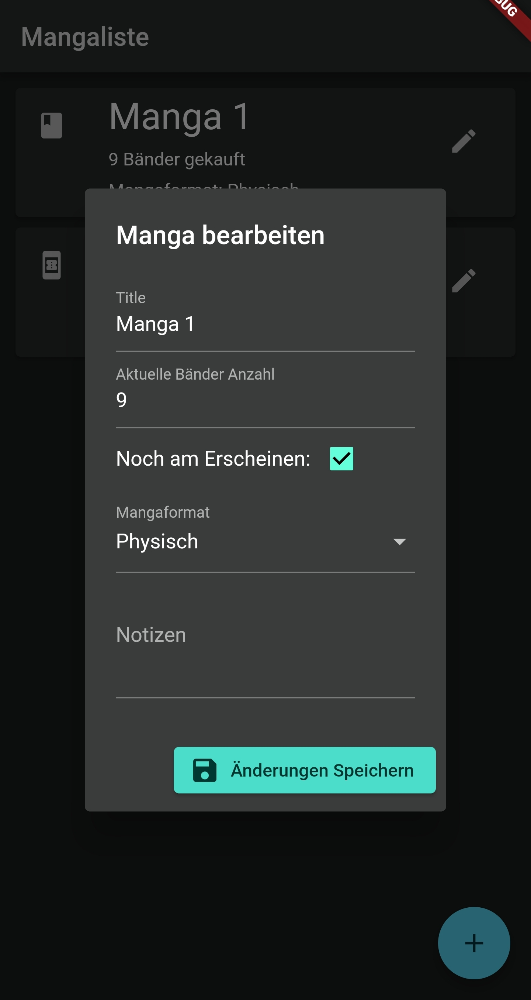
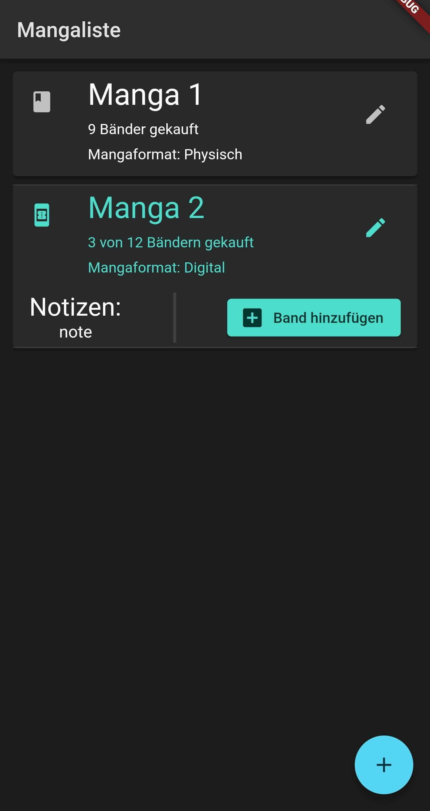
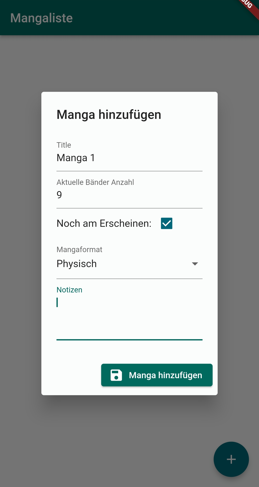
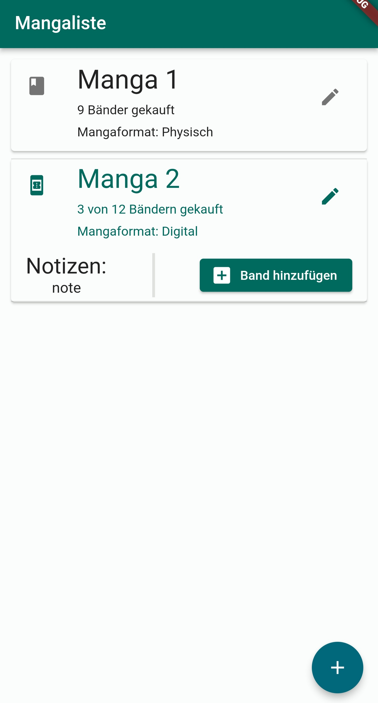

#  Manga Volume Tracker

Developed with Flutter Version 2.8.1

A simple app with the goal to manage your manga volumes.
Currently only tested and developed for Android.

## Get the App

The app is available in a F-Droid repository.
You can click [here](https://kbitgit.github.io/MangaVolumeTrackerRepo/fdroid/repo/) to add it or scan the QR Code:

## Features

The app tracks the following properties of a manga:

- Title
- Currently owned volumes
- Total volumes or if it is still releasing
- Format (physical or digital)
- Custom Notes

The app supports Dark mode.

## Some App Screenshots:

 

 
